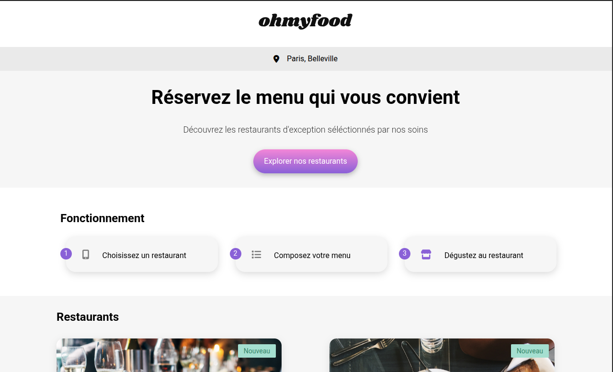

# Ohmyfood

## Description

Ohmyfood est une application web de réservation de restaurants développée dans le cadre de la formation Développeur Intégrateur Web d'OpenClassrooms.

L'objectif du projet était d'intégrer une interface responsive en approche mobile-first à partir de maquettes Figma et d'un prototype interactif. Une attention particulière a été portée aux animations CSS afin d'améliorer l'expérience utilisateur tout en conservant d'excellentes performances.

## Objectifs

* Intégrer une interface mobile-first.
* Mettre en œuvre des animations CSS avancées.
* Structurer les styles avec Sass.
* Développer plusieurs pages restaurants réutilisant une architecture commune.
* Versionner le projet avec Git et GitHub.

## Technologies utilisées

* HTML5
* CSS3
* Sass
* Animations CSS
* Media Queries
* Git
* GitHub
* GitHub Pages
* Figma

## Fonctionnalités

* Interface mobile-first
* Pages restaurants responsives
* Animations et transitions CSS
* Menus interactifs
* Navigation entre les restaurants
* Adaptation tablette et desktop
* Architecture Sass modulaire

## Compétences développées

* Mobile First
* Sass
* Animations CSS
* Responsive Design
* Organisation de feuilles de styles
* Réutilisation de composants
* Versionnement Git
* Publication GitHub Pages

## Aperçu

Interface de réservation de restaurants développée en mobile-first avec animations CSS, transitions fluides et adaptation responsive sur mobile, tablette et desktop.

## Lancer le projet

1. Cloner le dépôt.
2. Compiler les fichiers Sass.
3. Ouvrir le fichier `index.html` dans un navigateur.

## Auteur

Projet réalisé dans le cadre de la formation OpenClassrooms - Développeur Intégrateur Web.
